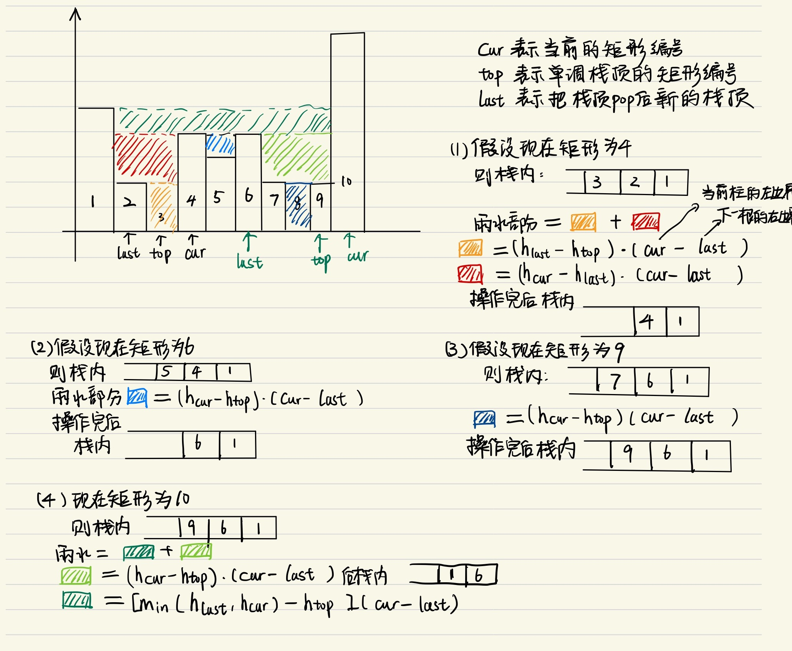

1维版本:<br>
method 1: 直接计算每个h[i]能够存的水
```C++
class Solution {
public:
    int trap(vector<int>& height) {
      if(height.empty()) return 0;
      int N = height.size(), res=0;
      vector<int>left(N),right(N); //left[i]表示第i根柱子左边最高的柱子有多高, right[i]表示第i根右边最高的柱子有多高
      left[0]=height[0];
      right[N-1]=height[N-1]; //边界的柱子不能存水
      for(int i=1; i<n; i++) left[i]=max(left[i-1], height[i]);
      for(int i=n-2; i>=0; i--) right[i]=max(right[i+1], height[i]);
      for(int i=0; i<n; i++) res += min(left[i], right[i])-height[i];
      return res;    
}

};
```
method2: 单调栈(monotonic stack)
```C++
class Solution {
public:
    int trap(vector<int>& height) {
      int N=height.size(), res=0;
      stack<int> st;
      for(int i=0; i<N; i++)
      {
        while(!st.empty() && height[i] >= height[st.top()])
        {
          int top = st.top();
          st.pop();
          if(st.empty()) break;
          int last = st.top();
          res += (min(height[i], height[last])-height[top])*(i-last-1);
        }
        st.push(i);
      }
      return res;
    }
};
```

2维版本:
